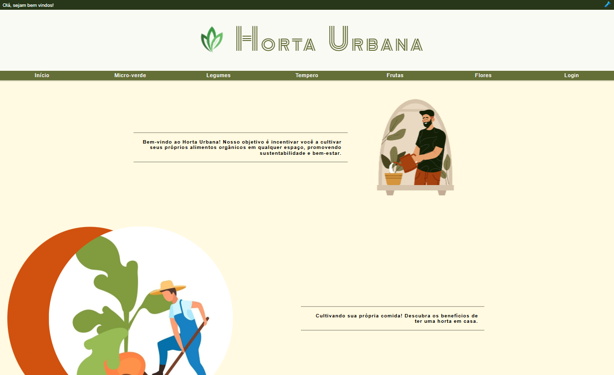

# Projeto integrador - Horta Urbana 🥦

## 💻 Descrição do projeto

O projeto Horta Urbana tem como objetivo proporcionar aos integrantes a experiência prática de criação e desenvolvimento do layout de um site, aplicando as melhores práticas de design e trabalho colaborativo.

  
👀 Prévia

  

 

**Colaboradores:**
| Nome             | Stack     |
| ---------------- | --------- |
| Igor Oliveira    | Back-end  |
| Evanói Nogueira  | Front-end |

> **Status:** Concluído ✅

## 📜 Índice

- [Descrição](#-descrição-do-projeto)
- [Conceitos Aprendidos](#-conceitos-aprendidos)
- [Tecnologias Utilizadas](#--tecnologias-utilizadas)
- [Instalação](#-instalação)
- [Uso](#-uso)
- [Funcionalidades](#-funcionalidades)
- [Pendências](#-pendências)
- [Contribuição](#-contribuição)
- [Informações Adicionais](#-informações-adicionais)
- [Licença](#-licença)
- [Conclusão](#-conclusão)

## ✅ Conceitos Aprendidos

1. Gestão e desenvolvimento de projetos
2. Colaboração através de Fork/Pull Request
3. Manipulação de DOM
4. Desenvolvimento de design
5. Boas práticas de clean code
6. Manipulação do localStorage

## 🛠 Tecnologias Utilizadas

## ⚙ Instalação

Para começar a usar este projeto, siga as etapas abaixo:

1. Faça um fork do repositório:
   <pre>git fork https://github.com/IgoRenatoo/JS-Proz-HortaUrbana.git</pre>

2. Clone o projeto para sua máquina:
   <pre>git clone https://github.com/< seu usuário >/JS-Proz-HortaUrbana.git</pre>

3. Acesse o diretório do projeto: `Dica ~> Escrever 'cd j+tab' completa o caminho`
   <pre>cd JS-Proz-HortaUrbana</pre>

## 🚀 Uso

Para visualizar o projeto, após instalação abra o arquivo `index.html` em seu navegador. Certifique-se de que todos os arquivos CSS e JavaScript estejam no diretório correto para garantir que o projeto funcione como esperado.

## 🧩 Funcionalidades

1. Criar conta
2. Realizar LogIn
3. Carrinho de compra
4. Metodo de pagamento fictício, sem adição de framework ou bibliotecas.
5. LightMode / DarkMode

## ⏳ Pendências

Pendências podem ser visualizadas na pasta `changelog`, lá foi documentado todos os próximos passos pendentes do projeto.

## 🤝 Contribuição

Contribuições são bem-vindas! Se você deseja contribuir com este projeto, siga as etapas abaixo:

1. Faça um fork deste repositório.
2. Clone o seu fork para sua máquina ( `git clone https://github.com/seu_usuário/TS-DIO-ProjectsCourseTypescript` ).
3. Crie uma branch para sua feature ou correção ( `git checkout -b sua-feature` ).
4. Commit suas alterações ( `git commit -m 'Mensagem desejada'` ).
5. Push para a branch ( `git push origin sua-feature` ).
6. Abra um Pull Request com título padrão e descrição da alteração
7. Aguarde à análise.

## 💡 Informações adicionais

Consulte a aba `Wiki` do projeto para instruções de PullRequest ~> [Wiki Horta Urbana](https://github.com/IgoRenatoo/JS-Proz-HortaUrbana/wiki/Informa%C3%A7%C3%B5es-Adicionais)

## 🔓 Licença

Este projeto está licenciado sob a Licença MIT.

## 🏁 CONCLUSÃO

O projeto <b>Horta Urbana</b> reforçou conhecimentos técnicos essenciais, como `manipulação de DOM` e o uso de persistência de dados utilizando o `localStorage`. Futuras melhorias podem incluir um sistema de pagamentos online, notificações personalizadas e otimizações de performance para aprimorar ainda mais a experiência do usuário.

🧑‍💻 "Programar é como escrever um livro. A única diferença é que se você cometer um erro, o código não vai te deixar ler até corrigir." 😅
